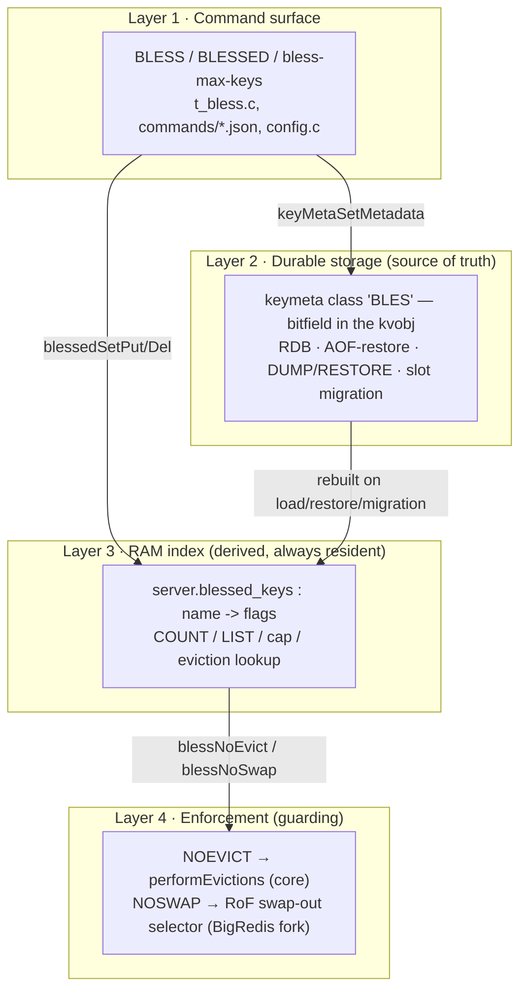
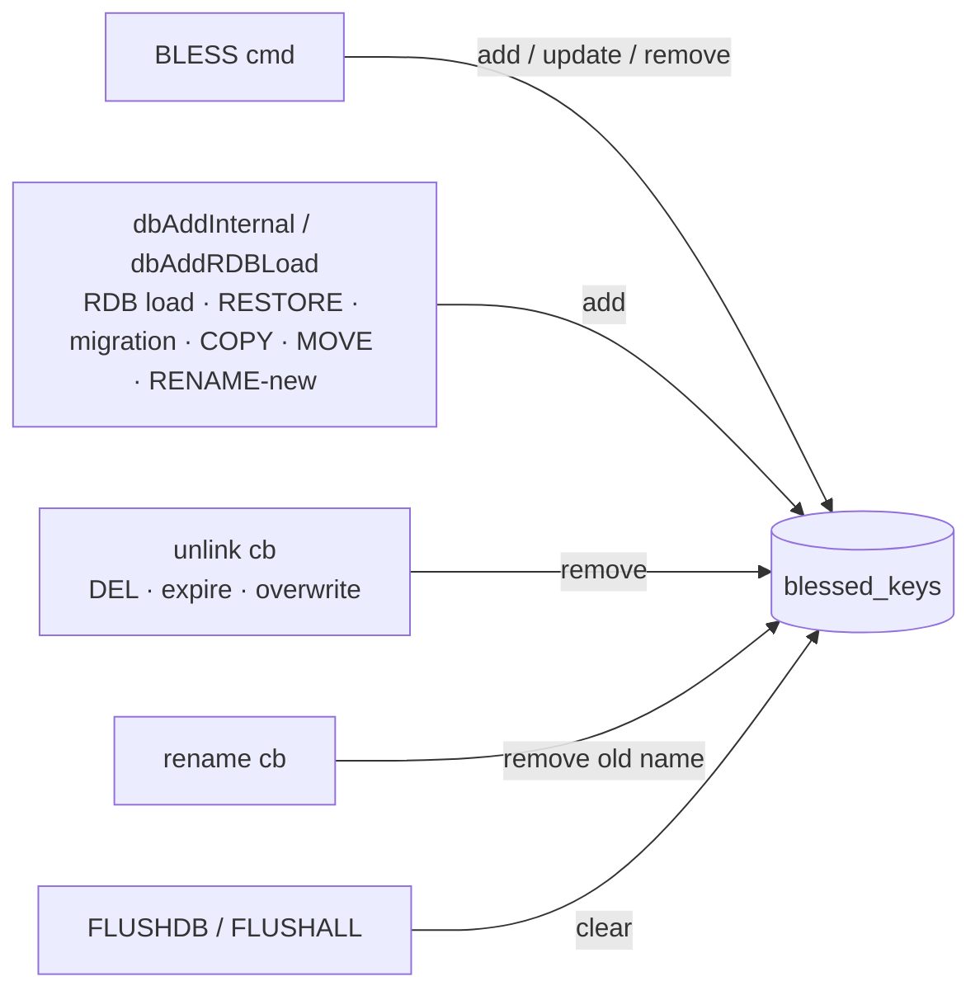
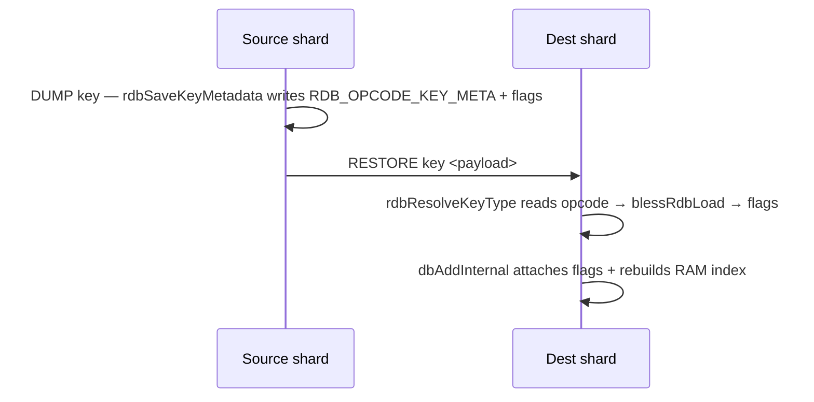
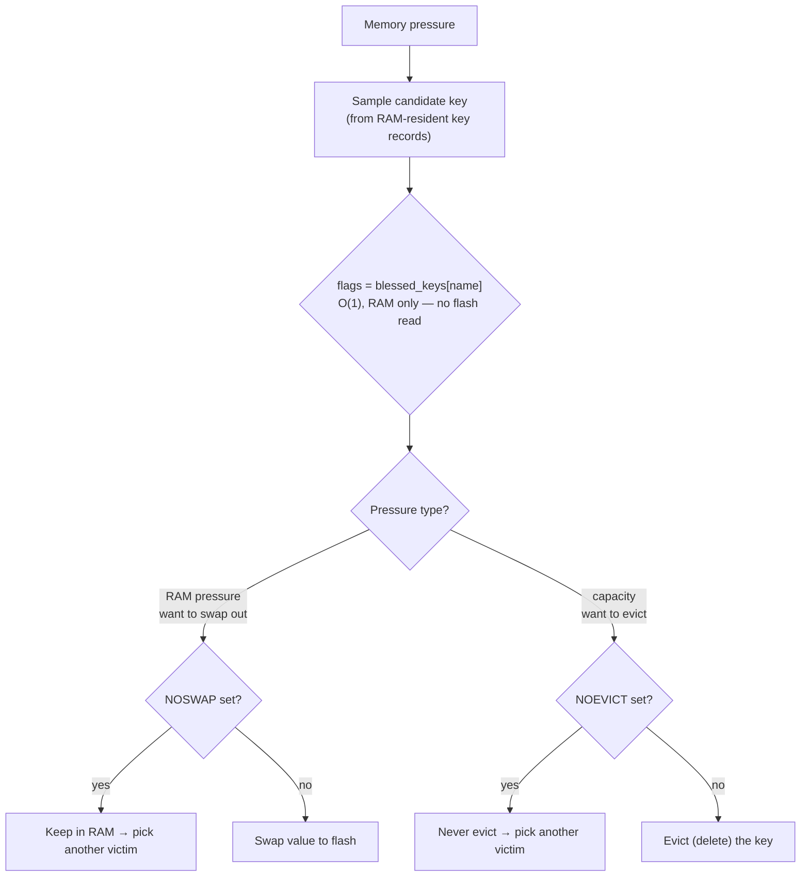

# BLESS — protect keys from eviction / swapping

Mark a small set of keys as **blessed** so they survive memory pressure. Aimed at
customers who run one DB mostly as a cache but keep a few non-cache keys
(counters, a stream or two) that must never disappear when eviction kicks in.

The protection is a **bitfield** — each bit is one independent guarantee:

| flag | meaning |
|------|---------|
| `NOEVICT` | never evicted (deleted) under `maxmemory` |
| `NOSWAP`  | kept in RAM, never swapped to flash (RoF only) |

Commands:

```
BLESS key NOEVICT                 # never evict
BLESS key NOSWAP                  # keep in RAM
BLESS key NOEVICT NOSWAP          # both (space- or '|'-separated)
BLESS key NOEVICT|NOSWAP          # same, one token
BLESS key AUFERRE                 # unbless (clear all flags)
BLESSED COUNT                     # number of blessed keys
BLESSED LIST                      # each blessed key -> its flags
```

Aliases (the ticket's names): `AETERNUS` = `NOEVICT`, `VELOX` = `NOEVICT|NOSWAP`,
`AUFERRE` = clear. Config: `bless-max-keys` (per node, default 1024).

---

## The one idea

Bless is a **durable per-key property**, exactly like TTL. TTL is keymeta class 0;
bless is a keymeta class too. That single decision gives us persistence and
migration transport for free. But a value stored *in the key* can be swapped to
flash under RoF — and the eviction/swap decision must never read flash. So bless
lives in **two places**, with one authoritative:

- **keymeta value** — the source of truth. Durable, migrates. May go to flash.
- **RAM index** — a derived mirror. Always resident. This is what decisions read.

Everything below is organized around those two representations and the four
layers that use them.

---

## Layered view



### Layer 1 — Command surface
`t_bless.c`, `commands/bless.json` + `blessed*.json`, `config.c`.

- `blessCommand` parses one or more flag tokens (each may be `|`-joined), ORs
  them into a bitfield, validates, then writes both representations. `AUFERRE`
  clears; combining `AUFERRE` with a flag is an error.
- The cap (`bless-max-keys`) is checked only for *newly* blessed keys; re-flagging
  an already-blessed key is free.
- `BLESS` is a `WRITE` command → replicated verbatim to replicas and AOF, so
  replicas build their own copy of both representations.
- `blessedCommand` serves `COUNT` (dict size) and `LIST` (a RESP3 map
  name → flag-string, RESP2 flat array).

### Layer 2 — Durable storage (source of truth)
keymeta class `"BLES"`, registered in `blessInit()` via
`keyMetaClassCreate(NULL, "BLES", 0, &conf)` with `reset_value = 0`.

- The level is a **bitfield in the class's 8-byte value slot**, stored inline in
  the value object (`kvobj`) — the same slot mechanism TTL uses. One bit in the
  object's `metabits` marks "has a BLES value"; the 8-byte slot holds the flags.
- `rdb_save`/`rdb_load` callbacks write/read the bitfield. `AUFERRE` writes the
  reset sentinel `0`, which the framework never serializes — an unblessed key
  carries nothing in RDB or in a migration payload.
- Because it's a keymeta class, the flag rides inline in DUMP/RESTORE and in the
  cluster slot-migration snapshot — same path as TTL, no separate channel.

### Layer 3 — RAM index (derived, always resident)
`server.blessed_keys` — a `dict` of key name → flags.

- Answers `COUNT`/`LIST`, enforces the cap, and is the structure the guarding
  layer consults **without touching flash**.
- Kept in sync only on the main thread. See "Keeping the two in sync" below.

### Layer 4 — Enforcement (guarding)
- **`NOEVICT`** — enforced in `evict.c`. `evictionPoolPopulate` skips blessed keys
  (and doesn't count them, so an all-blessed sample yields zero candidates and
  eviction stops with a normal OOM instead of spinning); the random-policy path
  retries to skip them. Reads `blessNoEvict(key)`.
- **`NOSWAP`** — enforced by the RoF swap-out selector in the BigRedis fork, which
  calls `blessNoSwap(key)`. Not present in this repo; a no-op without RoF.

---

## What lives in RAM vs. flash

This is the crux under RoF. There are three pieces of bless-related state:

| state | where it lives | on flash under RoF? | used for |
|-------|----------------|---------------------|----------|
| BLES bitfield (the flags) | inline in the `kvobj` value | **yes** — swaps out *with the value* | durability, migration transport |
| `metabits` presence bit | inline in the `kvobj` header | rides with the value | marks the slot present |
| `blessed_keys` RAM index | global `dict`, name → flags | **no** — always resident | every decision + COUNT/LIST/cap |

```
                 RAM                                      FLASH (RoF, cold keys)
 ┌───────────────────────────────────┐        ┌───────────────────────────────┐
 │ blessed_keys dict                 │        │  cold value object             │
 │   "counter:1" -> NOEVICT|NOSWAP   │◄────────│  [ BLES flags ][ robj ][ ... ] │
 │   "job:queue" -> NOEVICT          │  mirror │   (flags also here, but cold)  │
 │  (always resident, decisions here)│        └───────────────────────────────┘
 └───────────────────────────────────┘
```

Why two copies:

- The **keymeta value** is authoritative and must be durable, so it lives in the
  key and travels with it (RDB, migration). Under RoF the whole value — flags
  included — can be paged to flash.
- But eviction and swap-out decisions run over *RAM-resident key records* and must
  not issue a flash read to ask "is this blessed?". So the decision reads the
  **RAM index** by key name — O(1), always in RAM, regardless of where the value
  currently sits.

So: the flags are *stored* wherever the value is (RAM or flash); the flags are
*decided on* only from the RAM index. The RAM index is the reason a cold, on-flash
blessed key is still protected without paging it back in.

---

## Keeping the two in sync (main thread only)

The keymeta value is written whenever bless changes; the RAM index must track it
across every lifecycle event. All mutations happen on the main thread.



- **Add on load/migration** happens at the key-add choke points, not in the
  keymeta `rdb_load` callback — that callback receives a NULL key name (the key
  isn't live yet). RDB file load goes through `dbAddRDBLoad`; RESTORE/COPY/MOVE/
  RENAME go through `dbAddInternal`; both have a hook that reads the just-attached
  flags and calls `blessTrackKey`.
- **Remove** uses the `unlink` callback (main thread), never `free` — `free` may
  run on a lazyfree background thread and must not touch globals.
- **Rename** drops the old name in the `rename` callback; the new name is added by
  the `dbAddInternal` hook.
- **Flush** clears the whole index.

---

## Persistence & migration (free, via keymeta)



The same machinery serves RDB save/load and cluster slot migration; module aux
data is not involved (bless is per-key, not global). `AUFERRE` keys carry nothing
because the reset sentinel is never serialized.

---

## Eviction & swap decision

Under memory pressure the server considers a candidate key and decides: skip,
swap to flash, or evict. Two independent pressure sources:

- **RAM pressure** (RoF) → first response is *swap* RAM→flash.
- **Capacity / `maxmemory`** → response is *evict* (delete).

The decision reads the flags from the **RAM index by key name**, so it is the
same whether the value is currently in RAM or on flash. Residency does not change
the *decision*; it only limits the *action* (a value already on flash can't be
swapped again; a `NOSWAP` key is never on flash to begin with).



Decision matrix (rows = flag bits):

| flags               | evictable? | swappable to flash? |
|---------------------|------------|---------------------|
| none (`AUFERRE`)    | yes        | yes                 |
| `NOEVICT`           | **no**     | yes                 |
| `NOSWAP`            | yes        | **no** (pinned RAM) |
| `NOEVICT \| NOSWAP` | **no**     | **no**              |

Safety: if a sampled batch is entirely `NOEVICT`, the eviction sampler reports
zero candidates and stops, so the client gets a normal `OOM` error rather than the
server spinning. Confirmed under load.

---

## Scope

Implemented:

- Layers 1–3 in full: `BLESS`/`BLESSED`, the `bless-max-keys` cap, the keymeta
  bitfield storage, the RAM index, and RDB + DUMP/RESTORE + slot-migration
  transport.
- Layer 4 `NOEVICT`: enforced in `performEvictions` for both the pool
  (LRU/LFU/volatile-ttl) and random policies, with correct OOM termination.
  Helper `blessNoEvict(key)`.

Deferred:

- Layer 4 `NOSWAP`: the RoF swap-out selector lives in the BigRedis fork, not in
  this repo. The check is ready — the selector calls `blessNoSwap(key)`.
- `aof_rewrite` keymeta callback: bless survives RDB, replication and migration,
  but not an AOF rewrite yet. Add a callback that re-emits `BLESS`.
- Group blessing (bless many keys / a pattern in one command) — see the separate
  discussion; parked.
- Multi-DB: the RAM index is keyed by name and shared across DBs. Single-DB
  `FLUSHDB` over-clears, and same-named keys in different DBs collide. Fine for
  the single-DB target use case; make the index per-DB otherwise.
