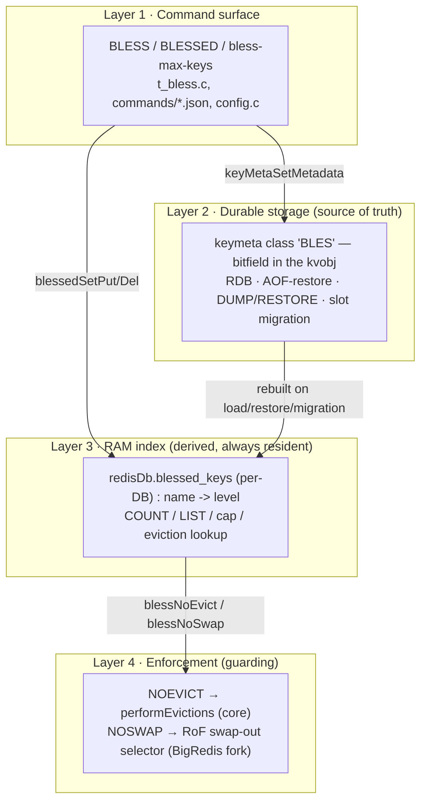
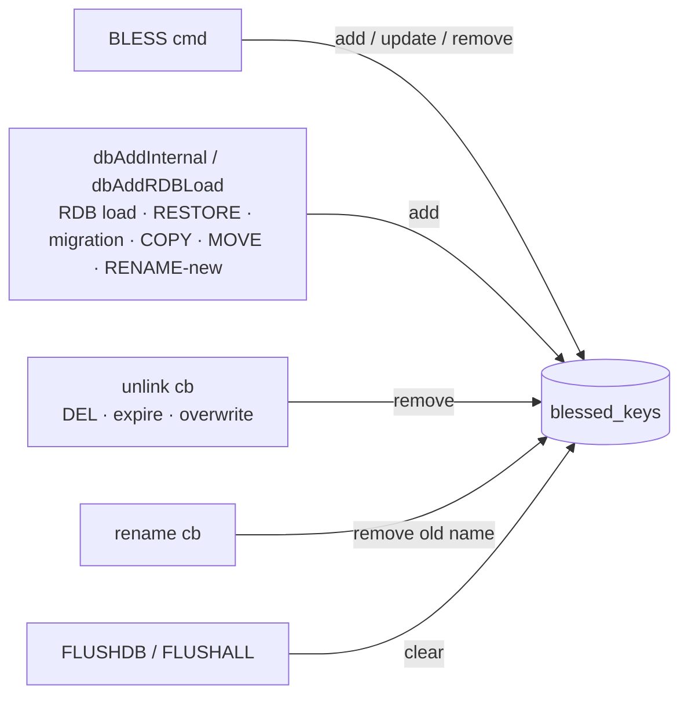
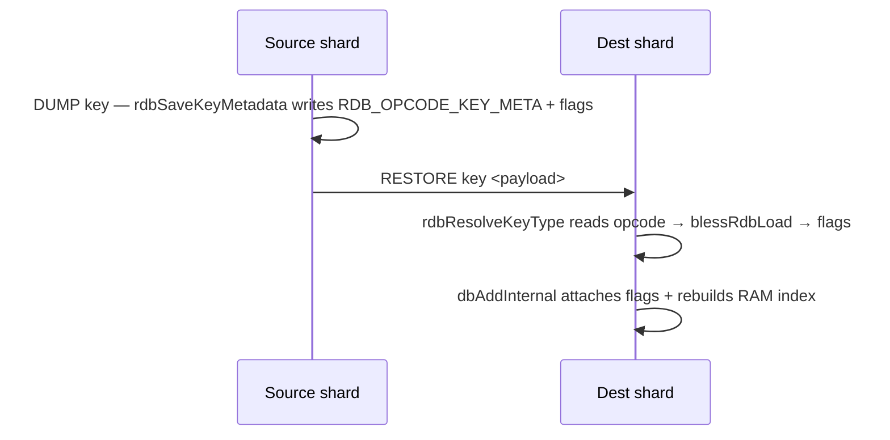
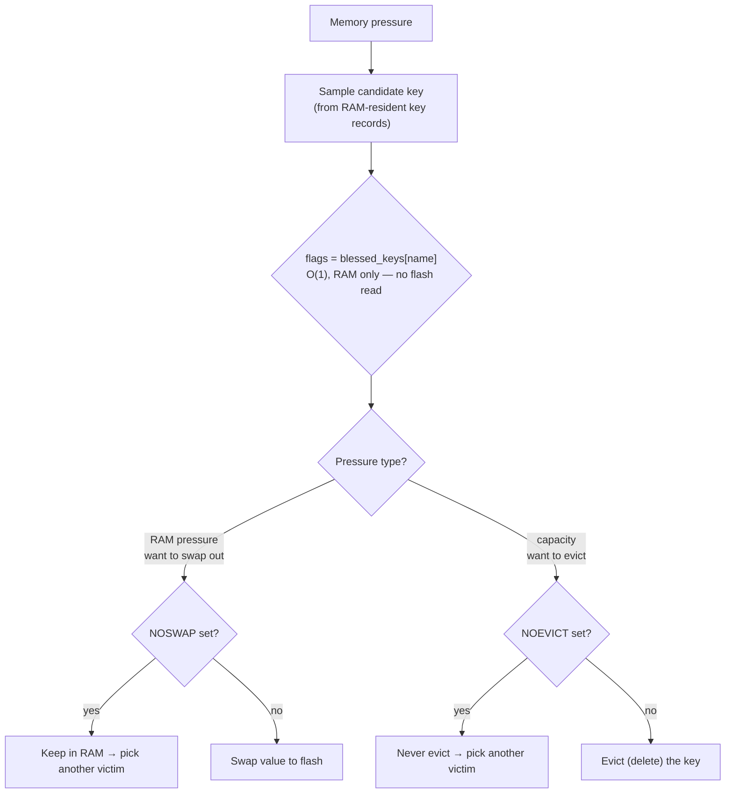
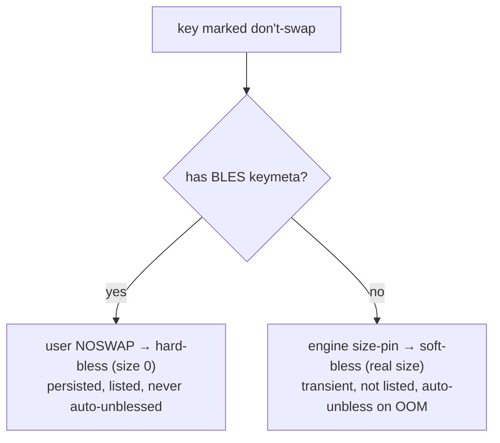
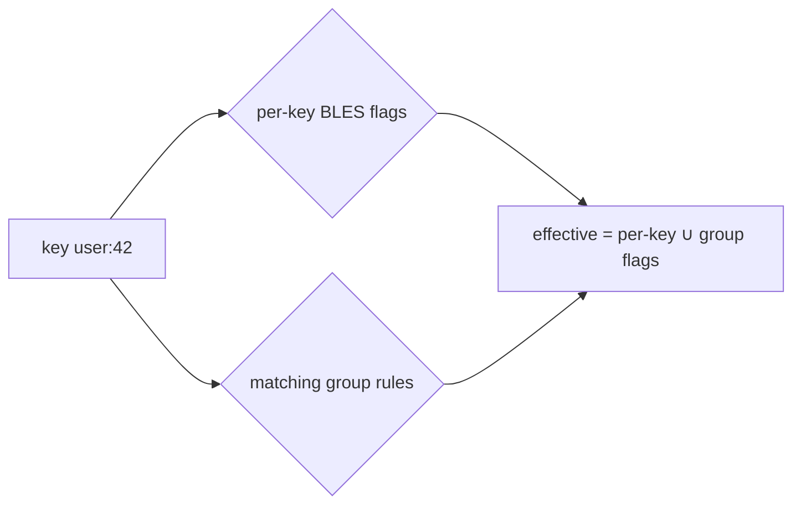

# BLESS — protect keys from eviction / swapping

Mark a small set of keys as **blessed** so they survive memory pressure. Aimed at
customers who run one DB mostly as a cache but keep a few non-cache keys
(counters, a stream or two) that must never disappear when eviction kicks in.

The protection is a **bitfield** — each bit is one independent guarantee:

| flag | meaning |
|------|---------|
| `NOEVICT` | never evicted (deleted) under `maxmemory` |
| `NOSWAP`  | kept in RAM, never swapped to flash (RoF only) |

Commands:

```
BLESS key NOEVICT                 # never evict
BLESS key NOSWAP                  # keep in RAM
BLESS key NOEVICT NOSWAP          # both (space- or '|'-separated)
BLESS key NOEVICT|NOSWAP          # same, one token
BLESS key AUFERRE                 # unbless (clear all flags)
BLESSED COUNT                     # number of blessed keys
BLESSED LIST                      # each blessed key -> its flags
```

Aliases (the ticket's names): `AETERNUS` = `NOEVICT`, `VELOX` = `NOEVICT|NOSWAP`,
`AUFERRE` = clear. Config: `bless-max-keys` (per node, default 1024).

---

## The one idea

Bless is a **durable per-key property**, exactly like TTL. TTL is keymeta class 0;
bless is a keymeta class too. That single decision gives us persistence and
migration transport for free. But a value stored *in the key* can be swapped to
flash under RoF — and the eviction/swap decision must never read flash. So bless
lives in **two places**, with one authoritative:

- **keymeta value** — the source of truth. Durable, migrates. May go to flash.
- **RAM index** — a derived mirror. Always resident. This is what decisions read.

Everything below is organized around those two representations and the four
layers that use them.

---

## Layered view



### Layer 1 — Command surface
`t_bless.c`, `commands/bless.json` + `blessed*.json`, `config.c`.

- `blessCommand` parses one or more flag tokens (each may be `|`-joined), ORs
  them into a bitfield, validates, then writes both representations. `AUFERRE`
  clears; combining `AUFERRE` with a flag is an error.
- The cap (`bless-max-keys`) is checked only for *newly* blessed keys; re-flagging
  an already-blessed key is free.
- `BLESS` is a `WRITE` command → replicated verbatim to replicas and AOF, so
  replicas build their own copy of both representations.
- `blessedCommand` serves `COUNT` (dict size) and `LIST` (a RESP3 map
  name → flag-string, RESP2 flat array).

### Layer 2 — Durable storage (source of truth)
keymeta class `"BLES"`, registered in `blessInit()` via
`keyMetaClassCreate(NULL, "BLES", 0, &conf)` with `reset_value = 0`.

- The level is a **bitfield in the class's 8-byte value slot**, stored inline in
  the value object (`kvobj`) — the same slot mechanism TTL uses. One bit in the
  object's `metabits` marks "has a BLES value"; the 8-byte slot holds the flags.
- `rdb_save`/`rdb_load` callbacks write/read the bitfield. `AUFERRE` writes the
  reset sentinel `0`, which the framework never serializes — an unblessed key
  carries nothing in RDB or in a migration payload.
- Because it's a keymeta class, the flag rides inline in DUMP/RESTORE and in the
  cluster slot-migration snapshot — same path as TTL, no separate channel.

### Layer 3 — RAM index (derived, always resident)
`redisDb.blessed_keys` — a **per-DB** `dict` of key name → level, one per numbered
DB, exactly like `db->expires`. Being per-DB makes it SWAPDB- and multi-DB-safe.

- Answers `COUNT`/`LIST`, enforces the cap, and is the structure the guarding
  layer consults **without touching flash**.
- Kept in sync only on the main thread. See "Keeping the two in sync" below.

### Layer 4 — Enforcement (guarding)
- **`NOEVICT`** — enforced in `evict.c`. `evictionPoolPopulate` skips blessed keys
  (and doesn't count them, so an all-blessed sample yields zero candidates and
  eviction stops with a normal OOM instead of spinning); the random-policy path
  retries to skip them. Reads `blessNoEvict(key)`.
- **`NOSWAP`** — enforced by the RoF swap-out selector in the BigRedis fork. The
  selector reads the engine's own `io_blessed_keys` set, so `NOSWAP` registers the
  key there (see "BigRedis / RoF integration" below). A no-op without RoF.

---

## What lives in RAM vs. flash

This is the crux under RoF. There are three pieces of bless-related state:

| state | where it lives | on flash under RoF? | used for |
|-------|----------------|---------------------|----------|
| BLES bitfield (the flags) | inline in the `kvobj` value | **yes** — swaps out *with the value* | durability, migration transport |
| `metabits` presence bit | inline in the `kvobj` header | rides with the value | marks the slot present |
| `blessed_keys` RAM index | per-DB `dict`, name → level | **no** — always resident | every decision + COUNT/LIST/cap |

```
                 RAM                                      FLASH (RoF, cold keys)
 ┌───────────────────────────────────┐        ┌───────────────────────────────┐
 │ blessed_keys dict                 │        │  cold value object             │
 │   "counter:1" -> NOEVICT|NOSWAP   │◄────────│  [ BLES flags ][ robj ][ ... ] │
 │   "job:queue" -> NOEVICT          │  mirror │   (flags also here, but cold)  │
 │  (always resident, decisions here)│        └───────────────────────────────┘
 └───────────────────────────────────┘
```

Why two copies:

- The **keymeta value** is authoritative and must be durable, so it lives in the
  key and travels with it (RDB, migration). Under RoF the whole value — flags
  included — can be paged to flash.
- But eviction and swap-out decisions run over *RAM-resident key records* and must
  not issue a flash read to ask "is this blessed?". So the decision reads the
  **RAM index** by key name — O(1), always in RAM, regardless of where the value
  currently sits.

So: the flags are *stored* wherever the value is (RAM or flash); the flags are
*decided on* only from the RAM index. The RAM index is the reason a cold, on-flash
blessed key is still protected without paging it back in.

---

## Keeping the two in sync (main thread only)

The keymeta value is written whenever bless changes; the RAM index must track it
across every lifecycle event. All mutations happen on the main thread.



- **Add on load/migration** happens at the key-add choke points, not in the
  keymeta `rdb_load` callback — that callback receives a NULL key name (the key
  isn't live yet). RDB file load goes through `dbAddRDBLoad`; RESTORE/COPY/MOVE/
  RENAME go through `dbAddInternal`; both have a hook that reads the just-attached
  flags and calls `blessTrackKey`.
- **Remove** uses the `unlink` callback (main thread), never `free` — `free` may
  run on a lazyfree background thread and must not touch globals.
- **Rename** drops the old name in the `rename` callback; the new name is added by
  the `dbAddInternal` hook.
- **Flush** clears the whole index.

---

## Persistence & migration (free, via keymeta)



The same machinery serves RDB save/load and cluster slot migration; module aux
data is not involved (bless is per-key, not global). `AUFERRE` keys carry nothing
because the reset sentinel is never serialized.

---

## Eviction & swap decision

Under memory pressure the server considers a candidate key and decides: skip,
swap to flash, or evict. Two independent pressure sources:

- **RAM pressure** (RoF) → first response is *swap* RAM→flash.
- **Capacity / `maxmemory`** → response is *evict* (delete).

The decision reads the flags from the **RAM index by key name**, so it is the
same whether the value is currently in RAM or on flash. Residency does not change
the *decision*; it only limits the *action* (a value already on flash can't be
swapped again; a `NOSWAP` key is never on flash to begin with).



Decision matrix (rows = flag bits):

| flags               | evictable? | swappable to flash? |
|---------------------|------------|---------------------|
| none (`AUFERRE`)    | yes        | yes                 |
| `NOEVICT`           | **no**     | yes                 |
| `NOSWAP`            | yes        | **no** (pinned RAM) |
| `NOEVICT \| NOSWAP` | **no**     | **no**              |

Safety: if a sampled batch is entirely `NOEVICT`, the eviction sampler reports
zero candidates and stops, so the client gets a normal `OOM` error rather than the
server spinning. Confirmed under load.

---

## BigRedis / RoF integration

Under RoF the swap engine (BigRedis, `bigstore.c` in the `redislabsdev/Redis`
fork) is what actually moves keys RAM↔flash. It already has a per-DB set,
`io_blessed_keys` — literally *"keys in RAM that should NOT be swapped to disk"* —
and every swap-out victim path skips keys in it (`isValidKeyForRamEviction`,
`getFirstRamEvictionCandidate`). It does **not** read core keymeta/`metabits` for
victim selection.

So `NOSWAP` does not need a new mechanism: a `NOSWAP` key is **registered in
`io_blessed_keys`** (the same thing `DEBUG bigredis-bless` does). The core keymeta
`BLES` class stays the durable source of truth; `io_blessed_keys` is the derived
enforcement cache the engine reads — mirrored on key-add, exactly like the RAM
index is for `NOEVICT`.

### The one thing to get right: user `NOSWAP` vs. size-driven bless

A key can end up "don't swap" for **two different reasons**, and they must not be
confused:

| reason | who sets it | lifetime | listed by `BLESSED LIST`? |
|--------|-------------|----------|---------------------------|
| user asked (`BLESS … NOSWAP`) | our command | until `AUFERRE` / key deleted | **yes** |
| value too big for flash (auto) | the engine, by size | until it shrinks / OOM unbless | no |

Two independent signals keep them apart — no new bookkeeping needed:

1. **keymeta is the discriminator for "user intent."** Only user-blessed keys get
   a `BLES` keymeta value; size-pinned keys have none. `BLESSED COUNT`/`LIST` read
   our keymeta-derived RAM set, so they show *only* user-blessed keys, never the
   auto size-pinned ones.
2. **The engine already separates the two inside `io_blessed_keys`:**
   - **hard-bless** (`BlessedValue` size 0) — explicit; **never** auto-unblessed.
   - **soft-bless** (real serialized size) — size-driven; **can** be auto-unblessed
     under OOM or when the value shrinks below the threshold.

**Rule:** register a user `NOSWAP` key as **hard-bless** (size 0). That is what
makes the guarantee hold — the engine's OOM auto-unbless explicitly skips size-0
entries, so a user-pinned key is never evicted from RAM behind the user's back. A
size-pinned key stays soft-bless and the engine keeps managing it independently.
`AUFERRE` removes only the user's hard-bless; if the key also happens to be big,
the engine re-pins it as soft-bless on its own — the two populations never merge.



### `NOEVICT` in the fork

`NOEVICT` cannot piggyback on `io_blessed_keys`: the fork's standard `maxmemory`
delete-eviction path (`performEvictionsEx`, `ram_eviction == 0`) does not consult
it. `NOEVICT` needs its own skip there — the same guard we added upstream, placed
at the fork's existing candidate-skip seams.

## Group blessing by prefix (proposed — NOT implemented)

A convenience for blessing many keys at once by **key-name prefix**, e.g. bless
every key under `user:`. Design only; no code yet.

### Command

```
BLESS GROUP <prefix> <FLAG ...>     # bless every key starting with <prefix>
BLESS GROUP <prefix> AUFERRE        # remove the group rule (and its blessings)
BLESS GROUPS                        # list all group rules -> flags
```
`FLAG` is the same set as `BLESS SET` (`NOEVICT`, `NOSWAP`, aliases). Lives under
the existing `BLESS` container as more subcommands.

There are two candidate approaches. They differ in **where the O(N) keyspace
cost lands** — at query time (Approach A) or at write/rule time (Approach B).

## Approach A — Rule-only (lazy evaluation) — RECOMMENDED

Store **only the rule**; never stamp individual keys. Blessing is *computed* at
the decision points.

- **Storage:** a per-node radix tree (`rax`) of `prefix -> flags`. This is the
  same structure client-side tracking already uses for `BCAST` prefixes
  (`PrefixTable`, `tracking.c`). Not attached to any key.
- **`BLESS GROUP user: NOEVICT`:** just `raxInsert` the rule — **O(1)**, no key
  scan. Future `user:*` keys are covered automatically (nothing to do on add).
- **Enforcement:** the guard becomes "explicitly blessed **or** matches a rule":
  `blessNoEvict(key) = key ∈ blessed_keys  OR  raxMatchesPrefix(bless_groups, key)`
  — O(key-length) per check, no flash read.
- **`COUNT` / `LIST` / `GROUPS`** answer about **definitions**, all cheap:
  - `BLESS COUNT` → number of explicit per-key blessings — O(1).
  - `BLESS LIST` → explicit per-key blessings (key → flags).
  - `BLESS GROUPS` → the rules (prefix → flags) — O(#rules).
  They deliberately do **not** enumerate "every key currently matching a prefix"
  — that expansion is inherently O(N) and is never hidden behind a blocking
  command. If it's truly needed, expose it only as a cursor: `BLESS GROUPSCAN
  <cursor>` (same engine as `SCAN`, incremental, non-blocking, opt-in).
- **Cost:** O(1) bless, O(key-len) per decision, tiny memory (just rules). The
  only O(N) is the opt-in cursor scan.

## Approach B — Materialize (eager stamp)

Iterate the whole keyspace and **stamp each matching key** as individually
blessed, so group members become real entries in `blessed_keys`/keymeta.

- **Storage:** the same `rax` rule table (still needed for *future* keys) **plus**
  a per-key BLES value on every matching key — i.e. the group is expanded into the
  per-key representation.
- **`BLESS GROUP user: NOEVICT`:** walk the entire keyspace and bless every match.
  Must be done with the **incremental cursor** (`kvstoreScan` / `dbScan`, the
  `SCAN` engine) driven from `serverCron` a slice at a time — **never** a
  synchronous `KEYS`-style loop, which would block the event loop on O(N).
- **On key creation** (`dbAddInternal` / `dbAddRDBLoad`): test the new key against
  the rules and stamp it if it matches.
- **`COUNT` / `LIST`:** cheap again — every protected key is a real entry in
  `blessed_keys`, so they read the materialized set directly (same as pure
  per-key). This is the payoff: the O(N) moves to rule-creation/scan, and queries
  are O(result).
- **Costs / the hard parts:**
  - **O(N) scan on every `BLESS GROUP`** (and again on `AUFERRE` to un-stamp).
  - **Per-key memory** — every group member carries its own 8-byte BLES slot.
  - **Origin tracking** — a key may be blessed *both* explicitly and by a group;
    un-stamping a group must not remove an explicit bless. Each entry needs to
    remember its source (origin bit / refcount), or `AUFERRE` on a group can
    wrongly unbless a hand-blessed key.
  - **Rule churn** — changing a rule re-scans; overlapping rules complicate
    un-stamping.

## A vs B

| | Approach A (rule-only) | Approach B (materialize) |
|---|---|---|
| `BLESS GROUP` cost | **O(1)** | O(N) keyspace scan |
| future keys | automatic (nothing on add) | per-add rule check + stamp |
| `COUNT`/`LIST` of members | not offered cheaply (cursor only) | **O(result), cheap** |
| memory | just the rules | + 8 bytes per matched key |
| removal (`AUFERRE`) | O(1) (drop rule) | O(N) re-scan + origin bookkeeping |
| complexity | low | high (origin tracking, scan scheduling) |

**Recommendation: Approach A.** It's O(1) to define, covers future keys for free,
and keeps memory flat. Its only weakness — enumerating a group's live members — is
a rare, admin-style need that Approach B pays for on *every* group op. Take B only
if cheap `COUNT`/`LIST` over *materialized* group members is a hard product
requirement.

## Effective flags (both approaches)

A key can be blessed individually **and** by a group. Effective protection is the
**union** of its per-key flags and every matching group rule's flags.



## Common concerns (both approaches)

- **Rule persistence.** The rule table is node config, not per-key data, so it
  needs its own persistence — mirror `FUNCTION`: a dedicated RDB section
  (`rdbSaveFunctions`/`rdbFunctionLoad` pattern) for snapshot restart, plus
  command propagation (`BLESS GROUP` is a `WRITE`) for AOF and replicas. Always
  RAM-resident, never swapped to flash.
- **Cap.** `bless-max-keys` bounds explicit per-key blessings; a prefix can match
  unbounded keys. Cap the **number of group rules** separately; don't count
  group-covered keys toward `bless-max-keys` (Approach A can't, and Approach B
  shouldn't).
- **Cluster / migration.** Rules are node-local; since keys migrate, the same
  rule must exist on every shard — replicate/broadcast the rule, not just per-key
  state.
- **RoF overlap.** A user group `NOSWAP` registers matching keys as hard-bless;
  auto size-bless stays soft (see "BigRedis / RoF integration").

## Scope

Implemented:

- Layers 1–3 in full: `BLESS`/`BLESSED`, the `bless-max-keys` cap, the keymeta
  bitfield storage, the RAM index, and RDB + DUMP/RESTORE + slot-migration
  transport.
- Layer 4 `NOEVICT`: enforced in `performEvictions` for both the pool
  (LRU/LFU/volatile-ttl) and random policies, with correct OOM termination.
  Helper `blessNoEvict(db, key)`.
- Per-DB + SWAPDB: `blessed_keys` lives on `redisDb` (like `expires`).
  `COUNT`/`LIST`/cap are per current DB; `SWAPDB` swaps the index with the data;
  no cross-DB name collision. Cleared per-DB in `emptyDbStructure`.

Deferred:

- Layer 4 `NOSWAP`: enforced in the BigRedis fork, not this repo. Wiring is to
  register the key in `io_blessed_keys` as hard-bless — see "BigRedis / RoF
  integration" above.
- `aof_rewrite` keymeta callback: bless survives RDB, replication and migration,
  but not an AOF rewrite yet. Add a callback that re-emits `BLESS`.
- Group blessing by prefix (`BLESS GROUP <prefix> …`) — designed, not implemented;
  see "Group blessing by prefix" above.
