# BLESS — protect keys from eviction / swapping

Mark a small set of keys as **blessed** so they survive memory pressure. Aimed at
customers who run one DB mostly as a cache but keep a few non-cache keys
(counters, a stream or two) that must never disappear when eviction kicks in.

## Levels

The protection is a single **ordered level** (a number, not a bitfield), so
stronger levels can be added later without changing storage. **Implemented today:
`NONE` and `NOEVICT`.** A stronger `INRAM` level is designed for but not yet
implemented (see "Future: adding INRAM/NOSWAP").

```
   NONE ───────────► NOEVICT ─ ─ ─ ─►  (INRAM)
  (0, unblessed)   (1, never evicted)   (2, planned: never evicted
                                          AND never swapped to flash)
```

| level | evictable (`maxmemory`)? | swappable to flash (RoF)? | status |
|-------|--------------------------|---------------------------|--------|
| `NONE`    | yes | yes | ✅ |
| `NOEVICT` | **no** | yes | ✅ |
| `INRAM`   | **no** | **no** (pinned in RAM) | 🔜 planned |

## Commands

`BLESS` is a container command (like `OBJECT`):

```
BLESS SET <key> [NO-EVICT ON|OFF] [INRAM ON|OFF]   # set protections (INRAM = future)
BLESS GET <key>                                    # -> policy type ("NO-EVICT" / "NONE")
BLESS COUNT                                         # number of protected keys in the CURRENT db
BLESS LIST                                          # map: key -> policy type, for the CURRENT db
```

Protection is expressed as two independent toggles (`ON` = more protection),
using the `ON|OFF` idiom of `CLIENT NO-EVICT` / `CLIENT TRACKING`:

- **`NO-EVICT ON|OFF`** — `ON` = never evicted under `maxmemory`; `OFF` = evictable.
  **Default (omitted): `NO-EVICT ON`**, so `BLESS SET <key>` protects the key.
- **`INRAM ON|OFF`** *(future — not implemented)* — `ON` = value never swapped to
  flash (Redis-on-Flash); `OFF` = may swap. Default: `INRAM OFF`.

`SET` replies `1` if a setting changed, `0` otherwise. A missing key is an error
(`ERR no such key`). `GET` returns the key's policy type as a bulk string, or
errors if the key does not exist.

The two toggles are the 2×2 matrix of the four levels:

| NO-EVICT | INRAM | meaning |
|---|---|---|
| OFF | OFF | normal key (evictable, swappable) |
| ON | OFF | protected from eviction (today's default `BLESS SET`) |
| OFF | ON | pinned in RAM but evictable *(future)* |
| ON | ON | never evicted **and** never swapped *(future)* |

No cap. Bless is intended for a **small number of keys**; there is no
`bless-max-keys` limit (a hard cap would be unenforceable on the migration /
RDB-load paths anyway).

## Future: adding INRAM/NOSWAP (minimal effort)

Because the level is stored as a **number** (in the keymeta value + the RAM
index), adding the stronger level is purely additive — no storage, index,
persistence, or migration change:

1. `#define BLESS_INRAM 2`
2. accept `INRAM` in `blessSetCommand` + add the token to `bless-set.json`
3. add `blessNoSwap(db,key) { return blessGetLevel(db,key) >= BLESS_INRAM; }`
4. have the BigRedis swap-out selector call `blessNoSwap()` (see "BigRedis / RoF integration")

The rest of this document describes the full design **including** that future
`INRAM`/`NOSWAP` level, so the current `NOEVICT`-only build is a strict subset.

---

## The one idea

Bless is a **durable per-key property, modeled exactly like TTL.** TTL is keymeta
class 0; bless is keymeta class `BLES`. That single decision buys persistence and
migration transport for free. And like TTL, it lives in two places:

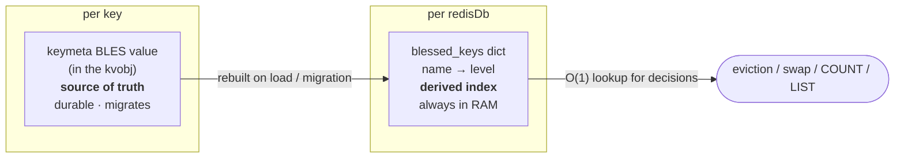

- **keymeta value** — the source of truth. Durable, migrates, may page to flash
  with its value.
- **`db->blessed_keys`** — a derived, always-resident index. Every decision and
  `COUNT`/`LIST` read *this*, so a cold (on-flash) key is still decided on without
  a flash read.

This mirrors TTL exactly: keymeta expire (class 0) is the source of truth, and
`db->expires` is the derived per-DB index.

---

## Layered view

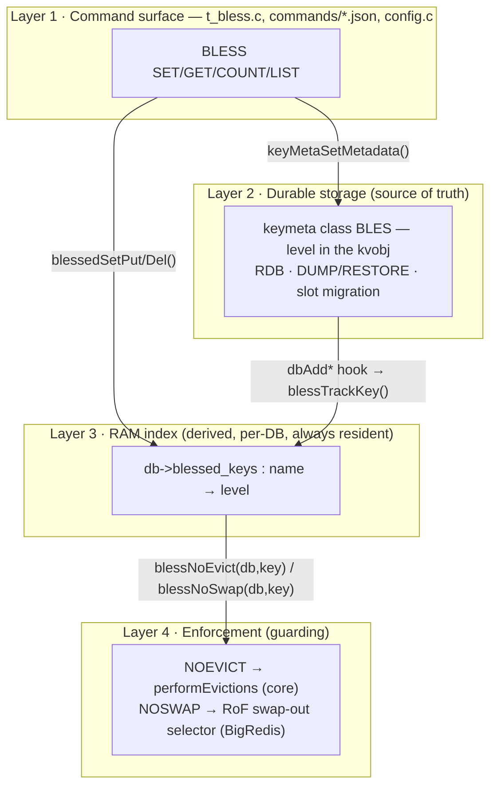

### Function interaction map

The actual functions and how they cross the layers:

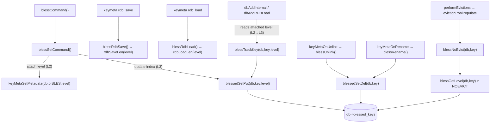

- **L1 command** writes *both* the keymeta value (L2) and the index (L3).
- **L2 load/migration** funnels through the `dbAdd*` hook, which reads the freshly
  attached level and calls `blessTrackKey` to rebuild L3.
- **L3 removals** ride the main-thread `unlink`/`rename` keymeta callbacks.
- **L4 guards** are pure O(1) reads of L3.

---

## Write path — `BLESS SET k INRAM`

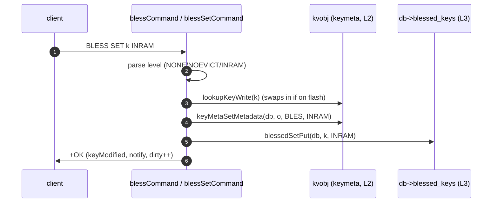

`NONE` takes the mirror path: `keyMetaSetMetadata(..., NONE)` (reset sentinel →
never persisted) + `blessedSetDel(db, k)`.

---

## Load / migration path — rebuilding the index from the keys

The keymeta `rdb_load` callback has **no key name** (the key isn't live yet), so
the index is rebuilt at the *key-add* choke points, not in the callback.

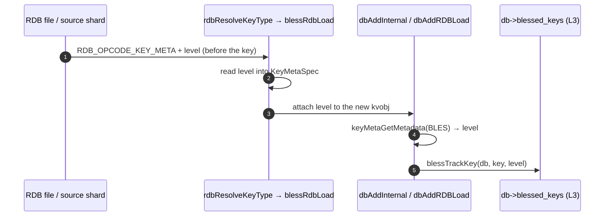

RESTORE / COPY / MOVE / RENAME-new go through `dbAddInternal`; RDB file load goes
through `dbAddRDBLoad`; both carry the hook, so cold (on-flash) keys are rebuilt
too — their level rides in the RAM-resident metadata, not with the flash value.

---

## Keeping the index in sync (main thread only)

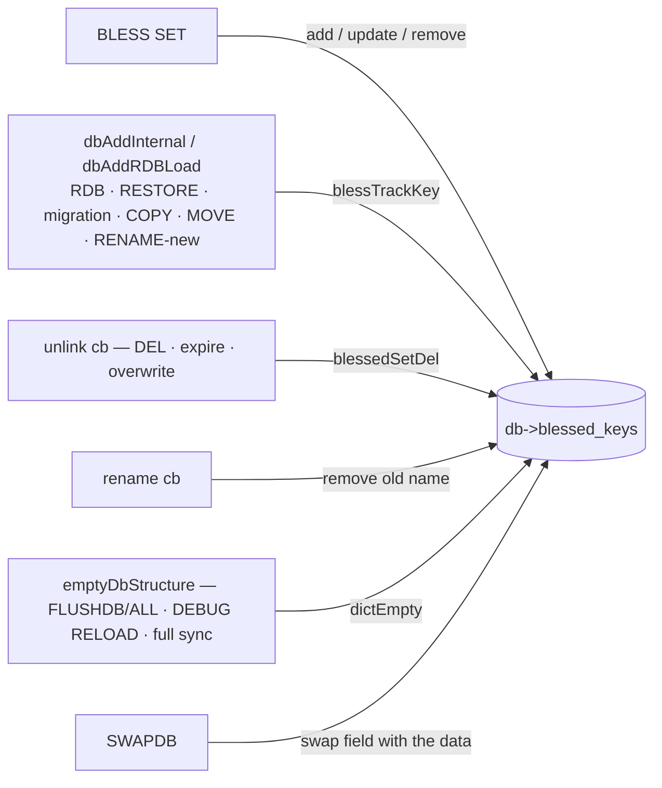

- **Remove** uses the `unlink` callback (main thread), never `free` (which may run
  on a lazyfree background thread and must not touch the DB).
- **Flush/reload** clears per-DB inside `emptyDbStructure`, so an empty-then-load
  never leaves stale entries.
- **SWAPDB** swaps `db->blessed_keys` alongside `keys`/`expires` — the index
  follows the data.

---

## What lives in RAM vs. flash (under RoF)

| state | where | on flash? | used for |
|-------|-------|-----------|----------|
| BLES level | inline in the `kvobj` value | **yes** — pages out with the value | durability, migration |
| `metabits` presence bit | in the `kvobj` header | rides with the value | marks the slot present |
| `db->blessed_keys` index | per-DB `dict` | **no** — always resident | every decision + COUNT/LIST |

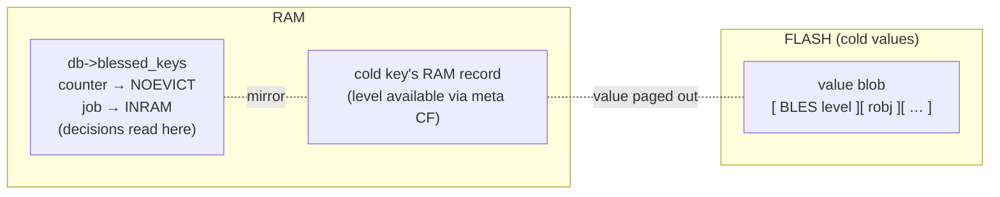

The level is *stored* wherever the value is; it is *decided on* only from the
always-resident index. That's why a cold blessed key is protected without a flash
read.

---

## Eviction & swap decision

Two independent pressure sources; the level is read once from the index:

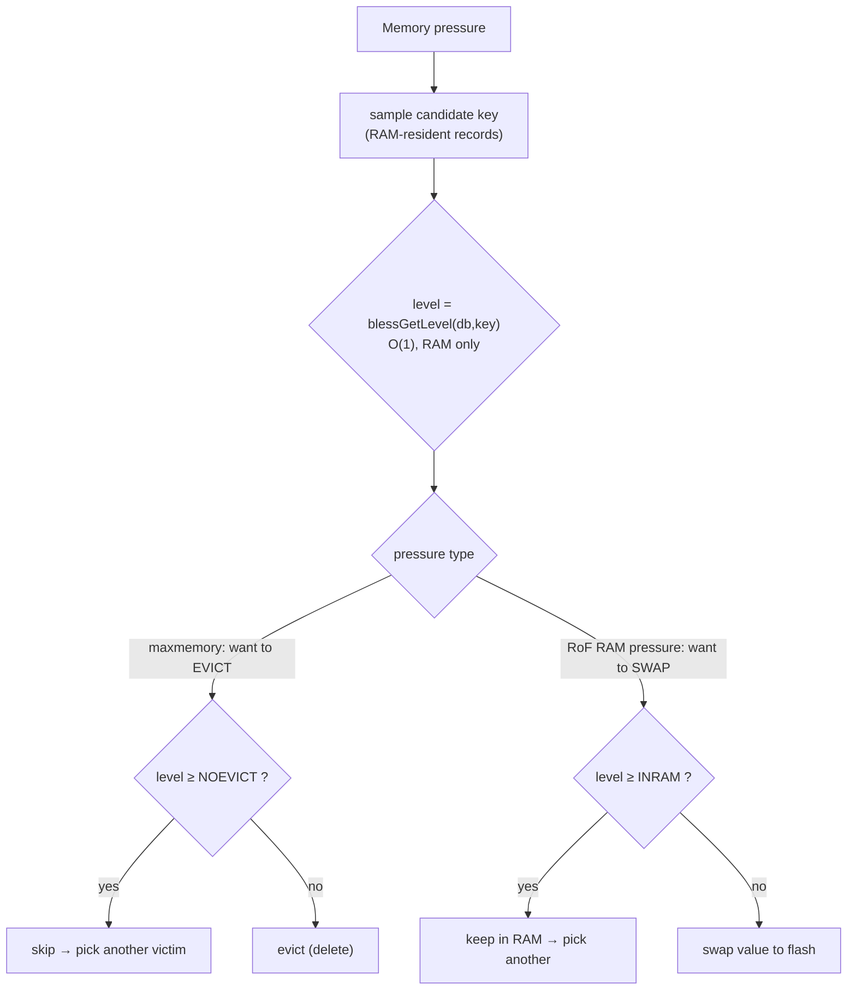

**Safety:** if a sampled batch is entirely `NOEVICT`+, `evictionPoolPopulate`
reports zero candidates, so eviction stops and the client gets a normal `OOM`
error instead of the server spinning. Verified under load.

---

## Persistence & migration (free, via keymeta)

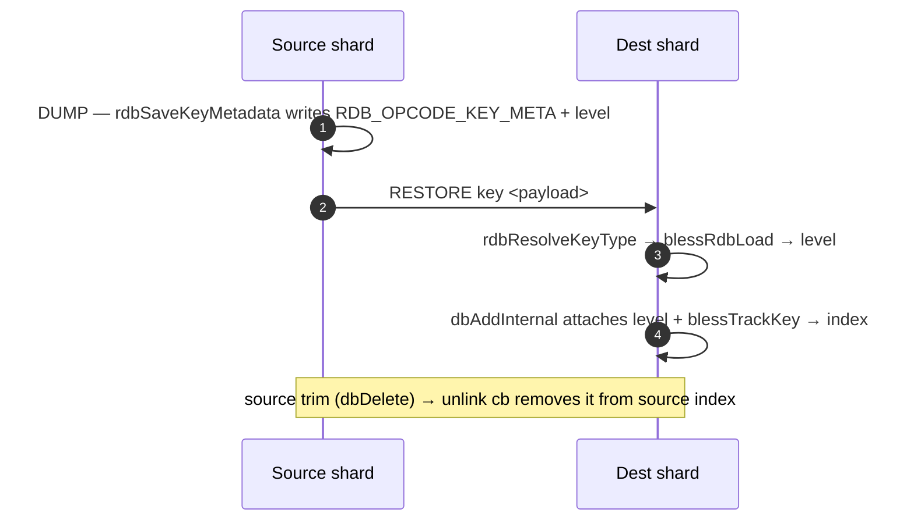

Same machinery for RDB save/load and cluster slot migration; no module-aux, no
separate channel. `NONE` keys carry nothing (reset sentinel is never serialized).

---

## BigRedis / RoF integration (`NOSWAP`)

The swap engine (BigRedis, in the `redislabsdev/Redis` fork) owns RAM↔flash. Its
swap-out victim selector already skips keys in its own per-DB set `io_blessed_keys`
("keys that must stay in RAM"). It does **not** read core keymeta.

**Recommended wiring — the engine queries core, no mirroring:**

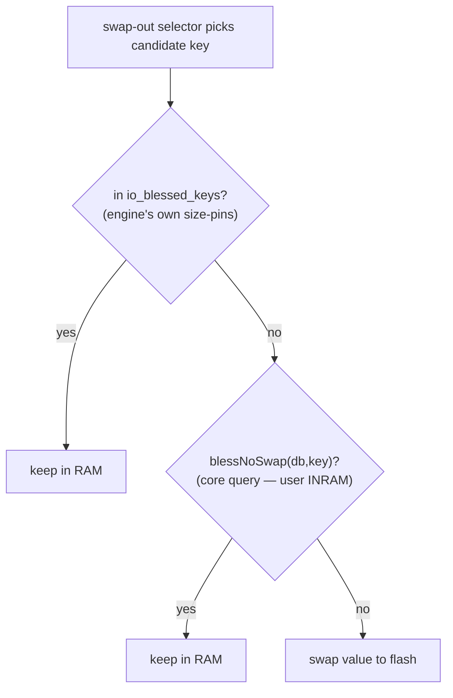

- **User `INRAM`** → the engine calls core `blessNoSwap(db,key)` at decision time.
  Nothing is copied into `io_blessed_keys`; single source of truth (core keymeta).
- **`io_blessed_keys`** keeps only the engine's *own* size-driven pins (values too
  big for flash / >4 GB). Core knows nothing about those; they stay engine-local.
- On load there's nothing to rebuild for user pins (core index rebuilds from
  keymeta); the engine re-derives size-pins from value sizes.

Caveat: the query must be safe from the thread that runs victim selection
(main-thread → fine).

*(Alternative, not preferred: mirror user `INRAM` into `io_blessed_keys` as a
"hard-bless" (size 0, never auto-unblessed). Reuses the existing skip but
duplicates state and needs load-time reconciliation.)*

### `NOEVICT` in the fork

`NOEVICT` can't piggyback on `io_blessed_keys`: the fork's `maxmemory`
delete-eviction path (`performEvictionsEx`, `ram_eviction == 0`) doesn't consult
it, and the flash-eviction path (`performFlashEvictionsEx`, `bigredis-evex.c`)
deletes cold keys entirely. Both must skip `NOEVICT` keys — the core guard we
added in `evict.c` plus a matching skip in the engine's flash-eviction candidate
scan. See "core vs BigRedis ownership" below.

### Core vs BigRedis ownership

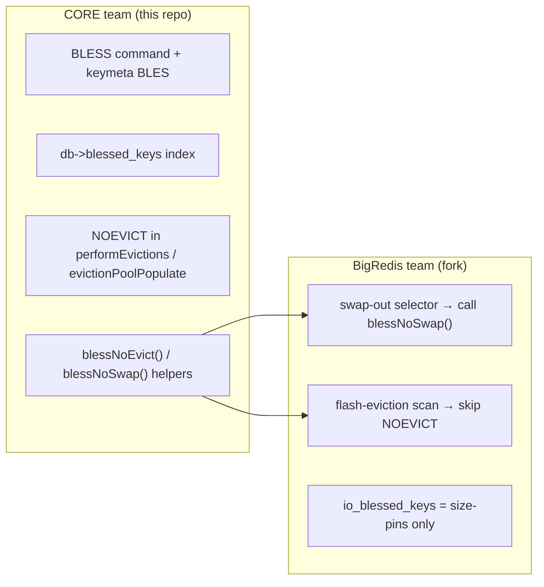

---

## Code reference (structs & functions)

### Types & storage

```c
/* t_bless.c — the level ladder (stored as the keymeta value) */
#define BLESS_NONE     0   /* unblessed; reset sentinel, never persisted */
#define BLESS_NOEVICT  1   /* never evicted, may swap to flash */
#define BLESS_INRAM    2   /* never evicted, always in RAM (implies NOEVICT) */

/* server.h — per-DB derived index, sits right next to db->expires */
typedef struct redisDb {
    kvstore *keys;
    kvstore *expires;
    dict    *blessed_keys;   /* key name (sds) -> level (in the value ptr) */
    /* ... */
} redisDb;

/* server.h — process-wide state */
struct redisServer {
    int bless_class_id;      /* keymeta class id assigned to "BLES" */
    /* ... */
};

/* t_bless.c — the per-DB dict type (sds key, level packed in the value ptr) */
static dictType blessedDictType = {
    dictSdsHash, NULL, NULL, dictSdsKeyCompare, dictSdsDestructor, NULL, NULL
};
dict *blessedDictCreate(void) { return dictCreate(&blessedDictType); }
```

### Index helpers (Layer 3)

```c
/* t_bless.c */
static void blessedSetPut(redisDb *db, sds name, uint64_t level);   /* add/update */
static void blessedSetDel(redisDb *db, sds name);                   /* remove */
static uint64_t blessGetLevel(redisDb *db, sds name);               /* -> level or NONE */

void blessTrackKey(redisDb *db, sds name, uint64_t level) {          /* public: dbAdd* hook */
    blessedSetPut(db, name, level);
}
int blessNoEvict(redisDb *db, sds name) { return blessGetLevel(db,name) >= BLESS_NOEVICT; }
int blessNoSwap (redisDb *db, sds name) { return blessGetLevel(db,name) >= BLESS_INRAM;  }
```

### keymeta class BLES — source of truth (Layer 2)

```c
/* t_bless.c — persistence rides in the keymeta value; NONE is never written */
static void blessRdbSave(RedisModuleIO *io, void *r, uint64_t *meta) {
    UNUSED(r);
    if (rdbSaveLen(io->rio, *meta) == -1) io->error = 1;
}
static int blessRdbLoad(RedisModuleIO *io, uint64_t *meta, int encver) {
    UNUSED(encver);
    uint64_t v = rdbLoadLen(io->rio, NULL);
    if (v == RDB_LENERR) { io->error = 1; return -1; }
    *meta = v; return 1;                 /* attach; index rebuilt later in dbAdd* */
}
/* main-thread removal; NOT free() (which may run on a lazyfree bg thread) */
static void blessUnlink(struct RedisModuleKeyOptCtx *ctx, uint64_t *meta) {
    if (ctx->from_key && ctx->from_dbid >= 0)
        blessedSetDel(&server.db[ctx->from_dbid], ctx->from_key->ptr);
}
static int blessRename(struct RedisModuleKeyOptCtx *ctx, uint64_t *meta); /* drop old name */
static int blessKeep  (struct RedisModuleKeyOptCtx *ctx, uint64_t *meta); /* copy/move: keep */

void blessInit(void) {                    /* called once, after keyMetaInit(), before RDB load */
    KeyMetaClassConf conf; memset(&conf, 0, sizeof(conf));
    conf.flags       = (1u << KEY_META_FLAG_ALLOW_IGNORE);  /* old peers skip gracefully */
    conf.reset_value = BLESS_NONE;
    conf.rdb_save = blessRdbSave; conf.rdb_load = blessRdbLoad;
    conf.unlink   = blessUnlink;  conf.rename   = blessRename;
    conf.copy     = blessKeep;    conf.move     = blessKeep;
    server.bless_class_id = keyMetaClassCreate(NULL, "BLES", 0, &conf);
}
```

### Commands (Layer 1)

```c
/* t_bless.c — container dispatcher (OBJECT-style); arity/keys per subcommand JSON */
void blessCommand(client *c) {
    const char *sub = c->argv[1]->ptr;
    if      (!strcasecmp(sub,"set"))   blessSetCommand(c);
    else if (!strcasecmp(sub,"get"))   /* blessGetLevel(c->db, argv[2]) -> name or nil */;
    else if (!strcasecmp(sub,"count")) addReplyLongLong(c, dictSize(c->db->blessed_keys));
    else if (!strcasecmp(sub,"list"))  /* map over c->db->blessed_keys: name -> level */;
    else if (!strcasecmp(sub,"help"))  addReplyHelp(c, ...);
    else addReplySubcommandSyntaxError(c);
}

static void blessSetCommand(client *c) {          /* BLESS SET <key> NONE|NOEVICT */
    uint64_t level = /* parse c->argv[3] */;
    robj *o = lookupKeyWrite(c->db, c->argv[2]);  /* swaps a cold key in */
    if (!o) { addReply(c, shared.nokeyerr); return; }
    sds key = c->argv[2]->ptr;
    if (level == BLESS_NONE) {
        keyMetaSetMetadata(c->db, o, server.bless_class_id, BLESS_NONE);  /* sentinel */
        blessedSetDel(c->db, key);
    } else {
        keyMetaSetMetadata(c->db, o, server.bless_class_id, level);       /* source of truth */
        blessedSetPut(c->db, key, level);                                /* derived index */
    }
    keyModified(c, c->db, c->argv[2], NULL, 1); server.dirty++; addReply(c, shared.ok);
}
```

### Integration points (where core is touched)

```c
/* server.c  initServer() — create the per-DB index next to keys/expires */
server.db[j].blessed_keys = blessedDictCreate();

/* db.c  dbAddInternal() and dbAddRDBLoad() — rebuild the index on load/RESTORE/migration */
if (server.bless_class_id > 0 && (metabits & (1u << server.bless_class_id))) {
    uint64_t level;
    if (keyMetaGetMetadata(server.bless_class_id, kv, &level) && level != 0)
        blessTrackKey(db, key /* ->ptr */, level);
}

/* db.c  emptyDbStructure() — wipe per-DB on flush / DEBUG RELOAD / full sync */
dictEmpty(dbarray[j].blessed_keys, NULL);

/* db.c  dbSwapDatabases() / swapMainDbWithTempDb() — index follows the data */
db1->blessed_keys = db2->blessed_keys;
db2->blessed_keys = aux.blessed_keys;

/* evict.c  evictionPoolPopulate() and the random-policy branch — NOEVICT guard */
if (blessNoEvict(db, key)) continue;   /* skip; not counted -> clean OOM if all blessed */
```

Files: `t_bless.c` (feature), `commands/bless*.json` (command table), `server.h`
(struct fields + prototypes), `server.c` (per-DB creation + `blessInit()`),
`db.c` (add hooks, empty, swapdb), `evict.c` (NOEVICT guard).

---

## Bless vs. TTL across value-changing commands

Bless is modeled on TTL, but with one deliberate difference: TTL is a value
lifecycle timer (reset on a fresh `SET`), whereas bless is a *protection* the
user set — so its natural default is to **survive** a value overwrite, the
opposite of TTL.

| command | what happens to the TTL | what happens to the bless |
|---|---|---|
| `SET` | cleared by default (kept only with `KEEPTTL`) | **kept by default** (clear only via `BLESS SET NONE`) — *deliberately opposite to TTL* |
| `GETSET` | cleared (like `SET`) | **kept** (survives, same as `SET`) |
| `RESTORE … REPLACE` | set from the command's `ttl` arg | set from the **dump payload** (the restored key's own bless) — full replace |
| `COPY` | carried from the source | **carried from the source** |
| `RENAME` | kept (the key keeps its TTL) | **kept** (carried to the new name) |

There is **no** bless equivalent of `KEEPTTL`, and one is not planned:
`KEEPTTL` is opt-in because `SET`'s default (reset TTL) is usually wanted; bless's
useful default is the inverse (keep the guarantee), so it is "keep-by-default"
with `BLESS SET NONE` as the explicit clear.

**Status vs. current code:** `COPY` / `RENAME` / `RESTORE REPLACE` already behave
as above (via the `copy`/`rename` callbacks and the dump payload). `SET` /
`GETSET` do **not** yet — today they drop bless (like TTL); making them
"keep-by-default" needs a small `dbSetValue` change (capture the old level before
the overwrite, re-apply it to the new object). See Scope → Open.

---

## Known gaps & limitations

Severity legend: 🟥 correctness/functional · 🟧 medium · 🟨 low · ⬜ by-design / decision.

- ⬜⬜ **AOF rewrite in legacy mode — very low severity.** With the **default**
  `aof-use-rdb-preamble yes`, `BGREWRITEAOF` writes an RDB base as the AOF
  preamble, and an RDB carries keymeta — so **bless already survives AOF rewrite
  by default**. The gap exists **only** if an operator sets
  `aof-use-rdb-preamble no` (legacy pure-RESP AOF): the rewrite emits commands
  and, since we registered no `aof_rewrite` keymeta callback, no `BLESS` command
  is written → bless is lost after that rewrite. Fix if ever needed: a ~10-line
  `aof_rewrite` callback that re-emits `BLESS SET <key> <level>`. Not planned,
  because the default config is unaffected.

---

## Scope

**Implemented (this repo):**

- Layers 1–3: `BLESS SET/GET/COUNT/LIST`, keymeta `BLES` storage (enum level),
  the per-DB `db->blessed_keys` index, and RDB + DUMP/RESTORE + slot-migration
  transport.
- Layer 4 `NOEVICT`: enforced in `performEvictions` for both the pool
  (LRU/LFU/volatile-ttl) and random policies, with correct OOM termination.
  `blessNoEvict(db, key)`.
- Per-DB + SWAPDB: `db->blessed_keys` (like `db->expires`); `COUNT`/`LIST` per
  current DB; `SWAPDB` swaps the index with the data; cleared per-DB in
  `emptyDbStructure` (no stale entries after reload).
- **No cap:** bless is intended for a small number of keys, so there is no
  `bless-max-keys` limit. A hard cap would be unenforceable anyway — migration
  and RDB load add to the index without passing through the command.

**Deferred:**

- Layer 4 `NOSWAP`: enforced in the BigRedis fork (see RoF integration). Core-side
  `blessNoSwap(db,key)` is ready.
- `NOEVICT` in the fork's flash-eviction scan (engine-side skip).
- `aof_rewrite` keymeta callback: bless survives RDB / replication / migration,
  but not an AOF rewrite yet.

**Open questions to decide:**

- **Bless across `SET`/`GETSET` — decided: keep-by-default, not yet implemented.**
  Today `SET`/`GETSET` drop bless (they build a fresh object; see "Bless vs. TTL
  across value-changing commands"). Target is **keep-by-default** (bless is a
  protection, not value lifecycle). Needs a small `dbSetValue` change: capture the
  old level before the overwrite, re-apply it to the new object. No `KEEPBLESS`
  flag. (`COPY`/`RENAME`/`RESTORE REPLACE` already behave correctly.)
- **OOM vs. `INRAM` — who wins?** Under RoF, if the smallest value the relief
  valve wants to swap out is a user `INRAM` key: honor `INRAM` (risk node OOM),
  let OOM win (break the pin as last resort), or hybrid (honor to a limit, then
  swap + warn)? Undecided.
