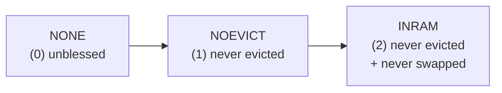
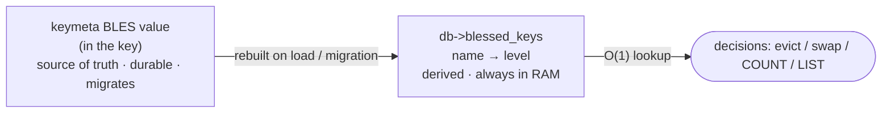
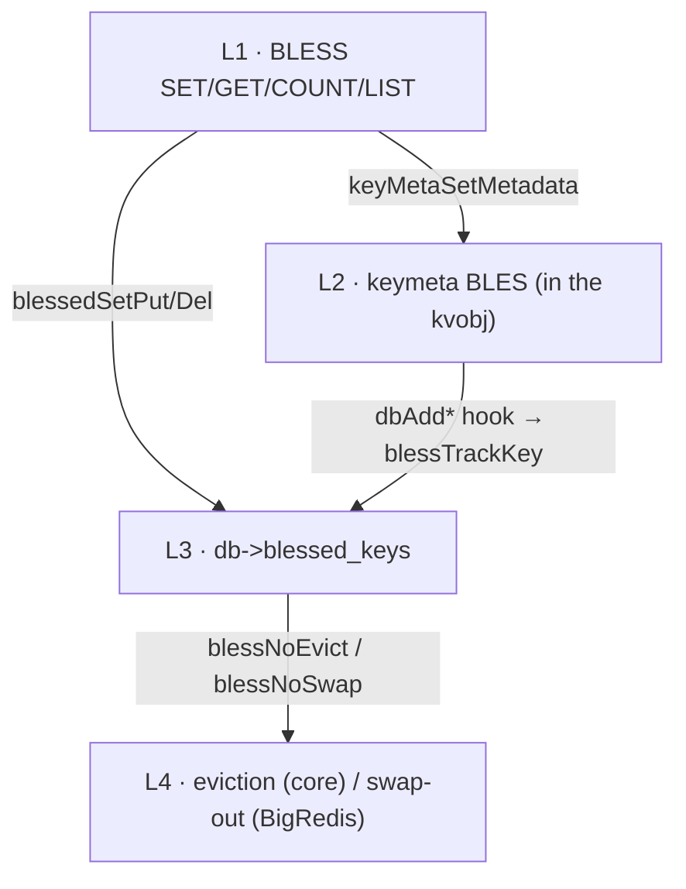
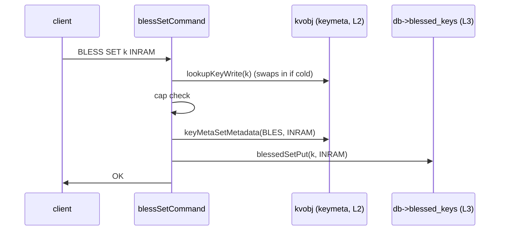
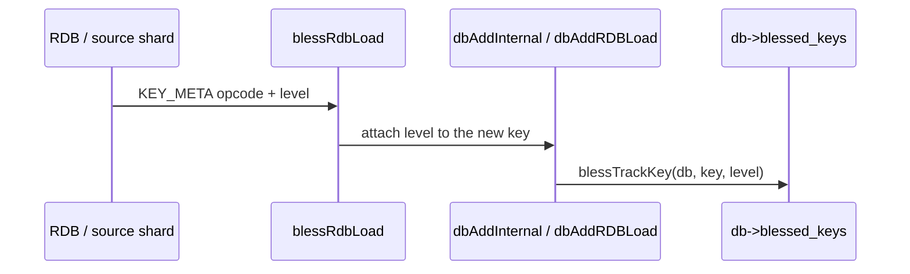
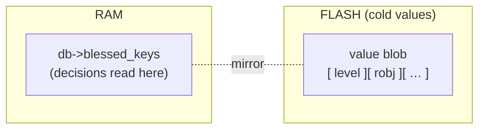
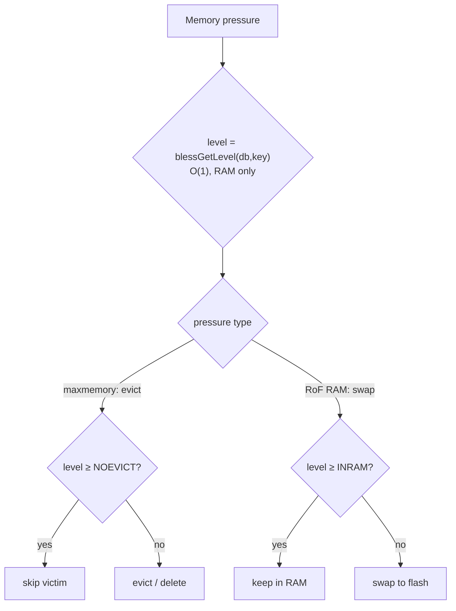
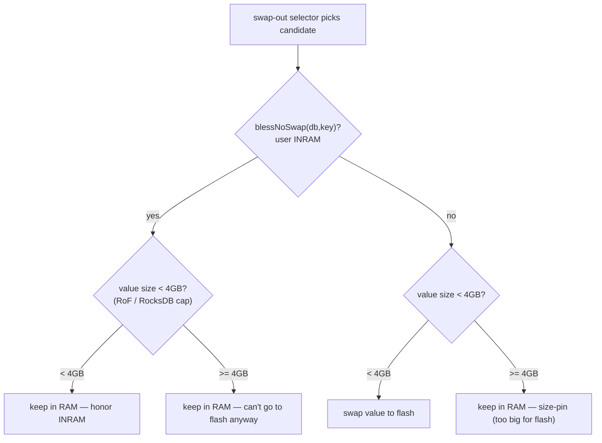
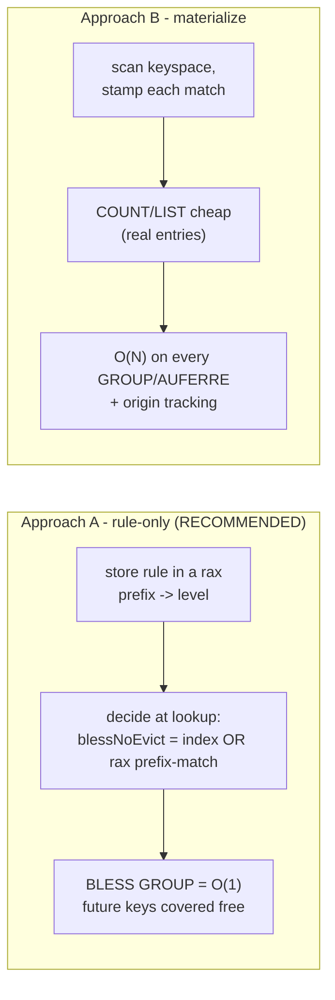

# BLESS — Presentation build guide (Google Slides)

This file is a **slide-by-slide script** for building a Google Slides deck about
the BLESS feature (protect keys from eviction / swapping). Each `## Slide N`
block is one slide: use the **Title** as the slide title, the **Body** bullets as
the slide content, and **Notes** as speaker notes.

## How to use the Mermaid diagrams in Google Slides

Google Slides can't render Mermaid natively. For each ```mermaid``` block:
1. Open <https://mermaid.live>, paste the block, and **Export → PNG** (or SVG).
   - Alternatively use the **"Mermaid to image"** / **"Diagrams"** Slides add-on
     (Extensions → Add-ons), which pastes the same syntax and renders it.
2. Insert the exported image on the slide (Insert → Image).
3. Keep the source block here so the diagram can be regenerated when the design
   changes.

Deck length: ~15 slides. Suggested theme: simple, one diagram per slide max.

---

## Slide 1 — Title

**Title:** BLESS — Protecting keys from eviction & swapping

**Body:**
- A data-path feature to mark specific keys as "blessed" so they survive memory pressure
- Never evicted (deleted), and optionally never swapped to flash
- RED-187857

**Notes:** One-line pitch: customers run a DB mostly as a cache but keep a few keys (counters, a stream) that must never disappear when eviction kicks in. BLESS guarantees that per key.

---

## Slide 2 — The problem

**Title:** Why we need it

**Body:**
- Many customers use Redis mostly as a **cache** → they enable eviction
- But a few keys are **not** cache (counters, small streams) and must **never** be evicted
- Today's workaround: separate DBs / instances for the non-cache keys
- Goal: one DB, mark a few keys as protected

**Notes:** Recurring customer request. The alternative (splitting workloads across DBs) is operationally painful. BLESS lets them mix safely.

---

## Slide 3 — What "blessed" means: the level ladder

**Title:** Three levels (an ordered ladder)

**Body:**
- `NONE` — normal key: may be evicted or swapped
- `NOEVICT` — never evicted; may still swap to flash (RoF)
- `INRAM` — never evicted **and** always in RAM (implies NOEVICT)



**Notes:** It's a single value, not a bitfield — each level is strictly stronger than the one below. This matches the ticket's original three levels.

---

## Slide 4 — The commands

**Title:** API — a `BLESS` container command

**Body:**
```
BLESS SET <key> NONE|NOEVICT|INRAM   # set level; NONE = unbless
BLESS GET <key>                      # -> "NOEVICT" | "INRAM" | nil
BLESS COUNT                          # blessed keys in the current DB
BLESS LIST                           # map: key -> level (current DB)
```
- Config: `bless-max-keys` (per DB, default 1024)
- Modeled on `OBJECT` (container + subcommands)

**Notes:** COUNT/LIST are per current DB, exactly like DBSIZE/KEYS. The cap bounds how many keys can be newly blessed.

---

## Slide 5 — The one idea: bless == TTL-shaped

**Title:** Same design as TTL

**Body:**
- Bless is a **durable per-key property** — just like TTL
- Stored two ways, one authoritative:
  - **Source of truth:** a per-key value in the object's metadata (keymeta)
  - **Derived index:** a per-DB in-RAM lookup table
- TTL does exactly this (keymeta class 0 + `db->expires`)



**Notes:** Because it's a keymeta class, persistence (RDB) and migration (DUMP/RESTORE) come for free — same path TTL uses. The derived index is what decisions read, so we never touch flash to ask "is this blessed?".

---

## Slide 6 — Layered architecture

**Title:** Four layers

**Body:**
- L1 Command surface — `t_bless.c`, JSON, config
- L2 Durable storage — keymeta class `BLES` in the key
- L3 RAM index — `db->blessed_keys` (per DB)
- L4 Enforcement — `NOEVICT` (core) + `NOSWAP` (BigRedis)



**Notes:** The command writes both L2 (durable) and L3 (index). Load/migration rebuilds L3 from L2. Enforcement is a cheap read of L3.

---

## Slide 7 — Storage: per-key (source of truth)

**Title:** Layer 2 — keymeta class `BLES`

**Body:**
- Level stored in the key's object metadata (8-byte keymeta slot)
- A `metabits` bit marks "this key has a bless value"
- Persisted to RDB and carried inline in DUMP/RESTORE — free, via keymeta
- `NONE` = reset sentinel → never persisted (unblessed keys cost nothing)

**Notes:** Exactly the slot mechanism TTL uses (TTL is class 0). New feature → uses the generic keymeta opcode with ALLOW_IGNORE so older peers skip it gracefully.

---

## Slide 8 — Index: per-DB (derived)

**Title:** Layer 3 — `db->blessed_keys`

**Body:**
- A `dict` on each `redisDb` (like `db->expires`)
- `name → level`, always in RAM
- Answers COUNT/LIST, enforces the cap, and drives eviction/swap decisions
- **Per-DB** → correct across multiple DBs and `SWAPDB`

**Notes:** Being per-DB (not global) is why SWAPDB and multi-DB "just work" — swapping DBs swaps their bless index along with keys/expires. Same reason TTL is per-DB.

---

## Slide 9 — Write path

**Title:** `BLESS SET k INRAM`



**Notes:** Both representations are written in one command. Blessing a cold (on-flash) key first pulls it into RAM via lookupKeyWrite.

---

## Slide 10 — Load & migration: rebuild the index from the keys

**Title:** The index is always rebuilt, never separately persisted



**Body:**
- keymeta `rdb_load` has no key name → rebuild happens at the key-add hook
- Covers RDB load, RESTORE, slot migration, COPY, MOVE, RENAME
- Cold keys included — level rides in RAM-resident metadata, not with the flash value

**Notes:** This is the "single source of truth" model: the index is derived from the keys every time, so it can't drift. Migration is just "load, streamed from another shard."

---

## Slide 11 — RAM vs flash (under RoF)

**Title:** What stays in RAM



**Body:**
- The level *stored* with the value can page to flash
- The level is *decided on* only from the always-resident index
- → a cold blessed key is protected **without a flash read**

**Notes:** This is the crux for RoF. Decisions (evict/swap) must never touch flash; the RAM index guarantees that.

---

## Slide 12 — Eviction & swap decision

**Title:** One lookup, two guards



**Body:**
- Safety: if a whole sample is `NOEVICT`+, the sampler returns zero candidates → clean `OOM` error, no spinning

**Notes:** Residency doesn't change the decision, only the available action. NOEVICT enforced in core eviction; NOSWAP on the RoF side.

---

## Slide 13 — BigRedis / RoF integration (NOSWAP)

**Title:** The engine queries core — no mirroring



**Body:**
- User `INRAM` → engine calls core `blessNoSwap()`; nothing duplicated (single source of truth)
- After that, a **hard 4 GB size cap** applies: a value **≥ 4 GB can never go to flash** (RocksDB limit) → stays in RAM regardless
- Only values **< 4 GB** can actually be swapped out — this is exactly what the engine's `io_blessed_keys` size-pins already track
- `io_blessed_keys` therefore holds only the engine's **size-driven** pins; user `INRAM` is answered by the core query

**Notes:** The swap engine lives in the BigRedis fork. The wiring: (1) ask core `blessNoSwap()` for user INRAM, and (2) apply the existing 4 GB size cap — a value ≥ 4 GB is force-kept in RAM whether or not the user blessed it. Only < 4 GB values are ever swap candidates. NOEVICT also needs a skip in the fork's flash-eviction scan.

---

## Slide 14 — Correctness: per-DB, SWAPDB, migration

**Title:** Edge cases handled

**Body:**
- **Per-DB / SWAPDB:** index lives on `redisDb`; SWAPDB swaps it with the data
- **Migration:** level rides in the RESTORE payload → rebuilt on the destination; source trim removes it
- **Reload/flush:** index cleared per-DB in `emptyDbStructure`, rebuilt on load (no stale entries)
- **Cap on import:** soft, command-time guard — migration/load may exceed it

**Notes:** All the lifecycle events (del, expire, rename, copy, flush, reload, swapdb, migrate) keep the index correct via the keymeta callbacks + the add hook.

---

## Slide 15 — Scope & open questions

**Title:** Status

**Body:**
- **Done (core):** commands, keymeta storage, per-DB index, RDB + migration, `NOEVICT` eviction guard, SWAPDB, cap
- **Deferred:** `NOSWAP` + flash-eviction skip (BigRedis fork), `aof_rewrite`, group blessing by prefix
- **Open questions:**
  - Does bless survive a value overwrite (SET)? (like KEEPTTL?)
  - OOM vs `INRAM` — who wins when RAM is full?

**Notes:** Core is implemented and tested. The remaining work is BigRedis-side (swap/flash-eviction) and two product decisions. Group blessing (bless by key prefix) is designed but not built.

---

## Slide 16 — Group blessing by prefix (concept)

**Title:** Group blessing by prefix (proposed)

**Body:**
- Bless many keys at once by **key-name prefix**, e.g. everything under `user:`
- Covers keys that exist now **and future** keys with that prefix
- Commands:
```
BLESS GROUP <prefix> NONE|NOEVICT|INRAM   # bless keys starting with <prefix>
BLESS GROUPS                              # list rules -> level
```
- Status: **designed, not implemented**

**Notes:** The natural reading of "prefix" is a dynamic rule — a later `SET user:42` should also be protected. Effective level on a key = max(its own level, any matching rule's level).

---

## Slide 17 — Group blessing: two options

**Title:** Two ways to build it — where does the O(N) cost land?



**Body (comparison table):**

| | A · rule-only | B · materialize |
|---|---|---|
| `BLESS GROUP` cost | **O(1)** | O(N) keyspace scan |
| future keys | automatic | per-add rule check + stamp |
| enumerate members | cursor only (`GROUPSCAN`) | **O(result), cheap** |
| memory | just the rules | + per matched key |
| removal (`AUFERRE`) | O(1) | O(N) re-scan + origin bookkeeping |

- **Recommendation: Approach A** — rule table (`rax` of `prefix → level`), evaluated at the eviction/swap decision. Same structure client-side tracking uses for `BCAST` prefixes.
- Take **B** only if cheap `COUNT`/`LIST` over materialized members is a hard requirement.

**Notes:** A keeps memory flat and is O(1) to define; its only weakness is enumerating a group's live members, which B pays for on *every* group op. Rules are node config → persist like FUNCTION and replicate to every shard; cap the *number of rules* (a prefix can match unbounded keys).

---

## Slide 18 — Open questions

**Title:** Open questions

**Body:**

1. **Unify TTL and our index into one map?**
   Both are per-DB per-key indexes. The difference: our bless index is **rebuilt
   from each key's metadata on load**, while TTL's is handled via its own path
   (saved/managed separately). Should they become a single shared key-attributes
   index, or stay separate?

2. **Key with both TTL and `NOEVICT` — who wins?**
   TTL says "delete at time T"; `NOEVICT` says "never remove." Does the key still
   expire (TTL wins, current behavior), or does `NOEVICT` override expiry too?

3. **Do we support grouping (bless by prefix)?**
   If yes, which method — **A** rule-only (O(1), lazy) or **B** materialize
   (stamp every key)?

4. **Who builds the BigRedis part?**
   The swap-out / flash-eviction wiring lives in the fork. Us (core team) or the
   Flex / BigRedis team?

**Notes:** Core is implemented and tested (commands, keymeta storage, per-DB index, RDB + migration, NOEVICT eviction, SWAPDB, cap). These four are the decisions left. End on: "Which do we lock down first, and who owns #4?"
