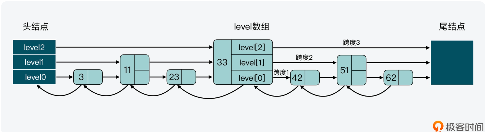

# SortedSet
> 本身是集合类型，同时也可以支持集合中的元素带有权重，并按权重排序。

* ZRANGEBYSCORE：按照元素权重返回一个范围内的元素。
* ZSCORE：返回某个元素的权重值。、

***为什么 Sorted Set 既能支持高效的范围查询，同时还能以 O(1) 复杂度获取元素权重值？***


## Sorted Set 基本结构
Sorted Set 的实现代码在t_zset.c文件中。Sorted Set 相关的结构定义在server.h文件中
```c
/**
 * Sorted set 结构体
 */
typedef struct zset {
    dict *dict; // 哈希表 dict
    zskiplist *zsl; // 跳表 zsl
} zset;
```


***跳表或是哈希表中，各自保存了什么样的数据？*** 

### 跳表数据结构

```c
/**
 * 跳表数据结构
 */
typedef struct zskiplist {
    struct zskiplistNode *header, *tail;
    unsigned long length;
    int level;
} zskiplist;

/**
 * 跳表节点结构
 */
typedef struct zskiplistNode {
    //Sorted Set中的元素
    sds ele;
    //元素权重值
    double score;
    //后向指针 为了便于从跳表的尾结点进行倒序查找
    struct zskiplistNode *backward;
    //节点的level数组，保存每层上的前向指针和跨度
    //跳表是一个多层的有序链表，每一层也是由多个结点通过指针连接起来的
    //level 数组来加速查询
    struct zskiplistLevel {
        // 指向下一结点
        struct zskiplistNode *forward;
        // 跨度，这是用来记录结点在某一层上的*forward指针和该指针指向的结点之间
        unsigned long span;
    } level[];
} zskiplistNode;
```


***跳表和哈希表保存的数据是如何保持一致的？***
> Sorted Set 先是通过在它的数据结构中同时定义了跳表和哈希表，来实现同时使用这两种索引结构。然后，Sorted Set 在执行数据插入或
> 是数据更新的过程中，会依次在跳表和哈希表中插入或更新相应的数据，从而保证了跳表和哈希表中记录的信息一致。
* 首先，zsetAdd 函数会判定 Sorted Set 采用的是 ziplist 还是 skiplist 的编码方式。
* 然后，如果 zsetAdd 函数通过 dictFind 函数发现要插入的元素已经存在，那么 zsetAdd 函数会判断是否要增加元素的权重值。


1、ZSet 当数据比较少时，采用 ziplist 存储，每个 member/score 元素紧凑排列，节省内存

2、当数据超过阈值（zset-max-ziplist-entries、zset-max-ziplist-value）后，转为 hashtable + skiplist 存储，降低查询的时间复杂度

3、hashtable 存储 member->score 的关系，所以 ZSCORE 的时间复杂度为 O(1)

4、skiplist 是一个「有序链表 + 多层索引」的结构，把查询元素的复杂度降到了 O(logN)，服务于 ZRANGE/ZREVRANGE 这类命令

5、skiplist 的多层索引，采用「随机」的方式来构建，也就是说每次添加一个元素进来，要不要对这个元素建立「多层索引」？建立「几层索引」？都要通过「随机数」的方式来决定

6、每次随机一个 0-1 之间的数，如果这个数小于 0.25（25% 概率），那就给这个元素加一层指针，持续随机直到大于 0.25 结束，最终确定这个元素的层数（层数越高，概率越低，且限制最多 64 层，详见 t_zset.c 的 zslRandomLevel 函数）

7、这个预设「概率」决定了一个跳表的内存占用和查询复杂度：概率设置越低，层数越少，元素指针越少，内存占用也就越少，但查询复杂会变高，反之亦然。这也是 skiplist 的一大特点，可通过控制概率，进而控制内存和查询效率

8、skiplist 新插入一个节点，只需修改这一层前后节点的指针，不影响其它节点的层数，降低了操作复杂度（相比平衡二叉树的再平衡，skiplist 插入性能更优）

关于 Redis 的 ZSet 为什么用 skiplist 而不用平衡二叉树实现的问题，原因是：

- skiplist 更省内存：25% 概率的随机层数，可通过公式计算出 skiplist 平均每个节点的指针数是 1.33 个，平衡二叉树每个节点指针是 2 个（左右子树）
- skiplist 遍历更友好：skiplist 找到大于目标元素后，向后遍历链表即可，平衡树需要通过中序遍历方式来完成，实现也略复杂
- skiplist 更易实现和维护：扩展 skiplist 只需要改少量代码即可完成，平衡树维护起来较复杂

***在使用跳表和哈希表相结合的双索引机制时，在获得高效范围查询和单点查询的同时，你能想到有哪些不足之处么？***

这种发挥「多个数据结构」的优势，来完成某个功能的场景，最大的特点就是「空间换时间」，所以内存占用多是它的不足。

不过也没办法，想要高效率查询，就得牺牲内存，鱼和熊掌不可兼得。

不过 skiplist 在实现时，Redis 作者应该也考虑到这个问题了，就是上面提到的这个「随机概率」，Redis 后期维护可以通过调整这个概率，进而达到「控制」查询效率和内存平衡的结果。当然，这个预设值是固定写死的，不可配置，应该是 Redis 作者经过测试和权衡后的设定，我们这里只需要知晓原理就好。

