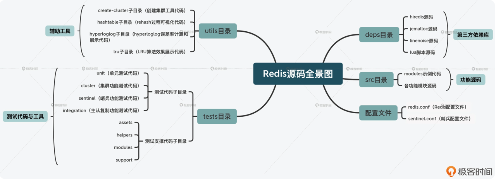
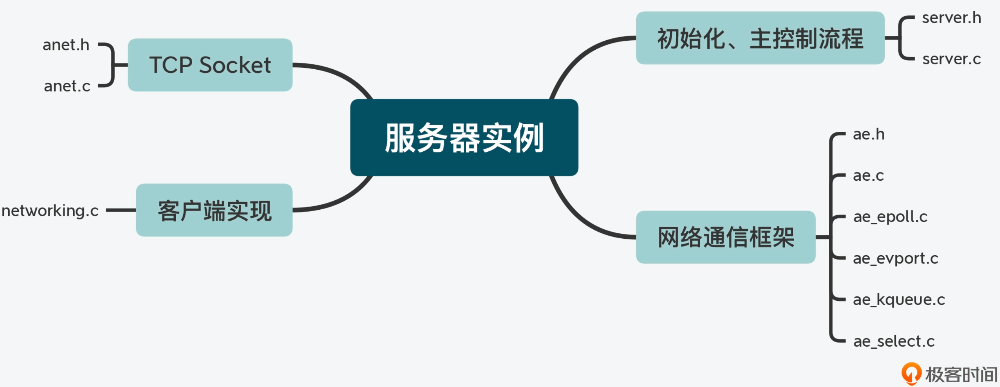
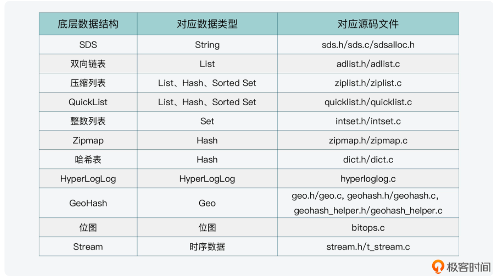
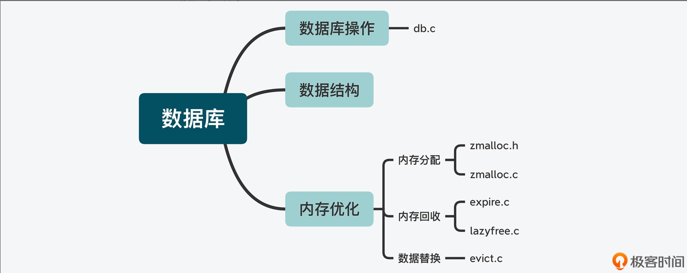

[TOC]

# 源码架构

## Redis 目录结构

### deps 
  > 包含了 Redis 依赖的第三方代码库，独立于 src 目录下的
  
  三类代码:
  1. Redis 依赖的、实现更加高效的功能库，如内存分配；
  2. 独立于 Redis 开发演进的代码，如客户端；
  3. lua 脚本代码

### src
> 包含了 Redis 所有功能模块的代码文件，也是 Redis 源码的重要组成部分
* modules
* 各功能模块源码

### tests
* 单元测试（对应 unit 子目录）
* Redis Cluster 功能测试（对应 cluster 子目录）
* 哨兵功能测试（对应 sentinel 子目录）
* 主从复制功能测试（对应 integration 子目录）

### utils
> 一些功能属于辅助性功能，包括用于创建 Redis Cluster 的脚本、用于测试 LRU 算法效果的程序，以及可视化 rehash 过程的程序

## Redis 功能模块与源码对应
### 服务器实例

### 数据库数据类型与操作

### 高可靠性和高可扩展性
* 数据持久化实现
* 主从复制功能实现
* 辅助功能

## 部分源码目录

数据类型：
- String（t_string.c、sds.c、bitops.c）
- List（t_list.c、ziplist.c）
- Hash（t_hash.c、ziplist.c、dict.c）
- Set（t_set.c、intset.c）
- Sorted Set（t_zset.c、ziplist.c、dict.c）
- HyperLogLog（hyperloglog.c）
- Geo（geo.c、geohash.c、geohash_helper.c）
- Stream（t_stream.c、rax.c、listpack.c）

全局：
- Server（server.c、anet.c）
- Object（object.c）
- 键值对（db.c）
- 事件驱动（ae.c、ae_epoll.c、ae_kqueue.c、ae_evport.c、ae_select.c、networking.c）
- 内存回收（expire.c、lazyfree.c）
- 数据替换（evict.c）
- 后台线程（bio.c）
- 事务（multi.c）
- PubSub（pubsub.c）
- 内存分配（zmalloc.c）
- 双向链表（adlist.c）

高可用&集群：
- 持久化：RDB（rdb.c、redis-check-rdb.c)、AOF（aof.c、redis-check-aof.c）
- 主从复制（replication.c）
- 哨兵（sentinel.c）
- 集群（cluster.c）

辅助功能：
- 延迟统计（latency.c）
- 慢日志（slowlog.c）
- 通知（notify.c）
- 基准性能（redis-benchmark.c）